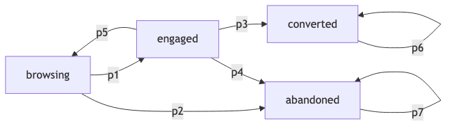

## Introduction

Consider a scenario where you are helping a team verify the behavior of a conversational interface agent for a campus service. This agent is intended to help students find information about courses, register for classes, or navigate campus resources. To ensure the agent behaves correctly and reliably, you need to formally model and verify its interaction patterns.

You decide to model how the interaction state transitions using a Discrete-Time Markov Chain (DTMC). The agent interacts with a user through several interaction states:

- **browsing**: user is exploring options
- **engaged**: user is actively interacting
- **converted**: user successfully completes the task
- **abandoned**: user gives up

The transition between the states are characterized by transition probabilities $p_i$.

The transition diagram would look like:

::: {.content-visible when-format="html"}
{width=100%}
:::

::: {.content-visible when-format="pdf"}
{width=100%}
:::

Note that browsing is the initial state and converted and abandoned are absorbing states.

Your task is to use model checking techniques to verify properties about the system's behavior, such as how likely users are to complete their tasks successfully (i.e., conversion) or abandon them before finishing.

## Q1. Reading a PCTL Formula

Consider the following two expressions:

- `F converted`
- `P>=0.7[F converted]`

For each expression, identify whether it is a state formula or a path formula in PCTL and explain your answer in one sentence.

::: {.callout-tip title="Answer" icon=false}
### Q1: Reading a PCTL Formula

- **`F converted`**: This is a **path formula** because it describes a property over a path (a sequence of states). The "F" (Finally) operator specifies that at some point in the future, the state formula `converted` must hold.

- **`P>=0.7[F converted]`**: This is a **state formula** because it quantifies over all paths from a state. The probability operator `P` with a threshold wraps a path formula, making the whole expression a state formula that is true or false for each state.
:::

## Q2. Interpreting Model Checking Results

Suppose you run PRISM on the DTMC model with the following specification: `P=? [ F "converted" ]`. And let's say the output that you obtain is 0.62. What does the output 0.62 mean? Explain in plain language.

::: {.callout-tip title="Answer" icon=false}
### Q2: Interpreting Model Checking Results

The output 0.62 means that, starting from the initial state (browsing), there is a **62% probability** that a user will eventually reach the "converted" state (i.e., successfully complete their task). In other words, about 62 out of every 100 users interacting with the agent are expected to successfully convert.
:::

## Q3. Writing Specifications in Temporal Logic

Write PCTL properties for all of the following:

1. The probability of eventually converting.
2. The probability of converting within 10 steps.
3. The probability of never reaching abandoned.
4. A specification that checks whether the probability of eventually converting is at least 0.6.

::: {.callout-tip title="Answer" icon=false}
### Q3: Writing Specifications in Temporal Logic

1. **The probability of eventually converting:**
   - `P=? [F converted]`

2. **The probability of converting within 10 steps:**
   - `P=? [F<=10 converted]`

3. **The probability of never reaching abandoned:**
   - `P=? [!abandoned U converted]` or equivalently `P=? [G !abandoned]` (for paths that eventually reach converted)

4. **A specification that checks whether the probability of eventually converting is at least 0.6:**
   - `P>=0.6 [F converted]`
:::

## Q4. Implementation

Create a model file called `conversion.pm` and implement the DTMC with appropriate transition probabilities. Create a property file named `conversion.pctl` and translate your answers from Q3 into PRISM's PCTL syntax. Run PRISM from the command line and report the outputs.

::: {.callout-tip title="Answer" icon=false}
**Transition Probabilities used:**
- p1 = 0.8 (browsing → engaged)
- p2 = 0.2 (browsing → abandoned)
- p3 = 0.5 (engaged → converted)
- p4 = 0.2 (engaged → abandoned)
- p5 = 0.3 (engaged → browsing)
- p6 = 1.0 (converted → converted, self-loop)
- p7 = 1.0 (abandoned → abandoned, self-loop)

**Model file (conversion.pm):**

```
dtmc

module conversion
  s : [0..3] init 0;  // 0=browsing, 1=engaged, 2=converted, 3=abandoned

  [] s=0 -> 0.8 : (s'=1) + 0.2 : (s'=3);
  [] s=1 -> 0.5 : (s'=2) + 0.2 : (s'=3) + 0.3 : (s'=0);
  [] s=2 -> (s'=2);
  [] s=3 -> (s'=3);
endmodule

label "converted" = (s=2);
label "abandoned" = (s=3);
```

**Property file (conversion.pctl):**

```
P=? [F "converted"]
P=? [F<=10 "converted"]
P=? [!"abandoned" U "converted"]
P>=0.6 [F "converted"]
```

**PRISM Results:**

| Property | Result |
|----------|--------|
| P=? [F "converted"] | **0.5263** (52.63% probability of eventually converting) |
| P=? [F<=10 "converted"] | **0.5259** (52.59% probability within 10 steps) |
| P=? [!"abandoned" U "converted"] | **0.5263** (same as eventual, as expected) |
| P>=0.6 [F "converted"] | **false** (probability is only 52.6%, not >= 60%) |

:::